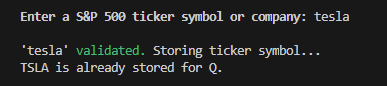
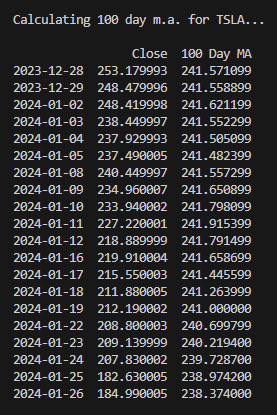

# Ticker Truth - Financial Analysis Tool

  - [Overview](#overview)
  - [UX/UI](#uxui)
    - [Strategy](#strategy)
      - [Goals](#goals)
      - [User Stories](#user-stories)
    - [Scope](#scope)
    - [Structure](#structure)
    - [Flowcharts](#flowcharts)
    - [Surface/Design](#surfacedesign)
      - [Welcome Message](#welcome-message)
      - [User Input and Validation](#user-input-and-validation)
      - [Order Overview](#order-overview)
      - [Live Status](#live-status)
  - [Features](#features)
    - [Existing Features](#existing-features)
    - [Future Features](#future-features)
  - [Bugs or Errors](#bugs-or-errors)
  - [Testing](#testing)
  - [Modules Imported](#modules-imported)
  - [Deployment](#deployment)
    - [Creating the Tool](#creating-the-tool)
    - [Deploying on Heroku](#deploying-on-heroku)
    - [Fork the Repository](#fork-the-repository)
    - [Clone the Repository](#clone-the-repository)
  - [Credits](#credits)
  - [Tools](#tools)
  - [Acknowledgements](#acknowledgements)

## Overview

Tapping into the vast realm of financial data, Ticker Truth empowers users to analyze stock ticker symbols and gain valuable insights. The tool's robust features include the ability to input and validate stock ticker symbols, view detailed financial data tables, and receive real-time analysis results.

The fully deployed project can be found [here](https://ticker-truth-2fc7abab85cc.herokuapp.com/).

## UX/UI

### Strategy

#### Goals

- **Intuitive User Experience:** Ensure a user-friendly interface for easy navigation.
- **Relevant Information:** Display pertinent information at each step of the analysis.
- **Clear Instructions:** Provide concise and clear instructions for seamless interaction.
- **Highlight Important Information:** Emphasize crucial details for an enhanced user experience.
- **Input Validation:** Ensure the user inputs existing stock tickers or companies.
- **Data Accuracy:** Access the correct data for accurate analysis and updates.
- **Duration Calculation:** Calculate and display a sensible duration for each analysis.
- **Search History:** Store and display the user's search history.

#### User Stories

- As a user, I want to be able to enter and save my username.
- As a user, I want to be able to enter a stock ticker symbol or company name.
- As a user, I want to be able to get the latest stock data for that ticker symbol
- As a user, I want to be able to calculate the daily change for a stock ticker symbol.
- As a user, I want to be able to calculate the 100 day moving average for a stock ticker symbol.
- As a user, I want to be able to see a list of my previous searches.
- As a user, I want to be able to enter a new stock ticker symbol and have it added to my list of previous searches.
- As a user, I want to be able to go back to the user menu.
- As a user, I want to be able to quit the program at any time.

### Scope

Ticker Truth covers a broad spectrum of features to meet users' analytical needs:

- **Financial Data Display:** Present detailed financial data tables for thorough analysis.
- **User Input and Validation:** Allow users to input stock ticker symbols or company names and validate them.
- **Warning System:** Implement a warning system for invalid inputs to enhance user accuracy.
- **Analysis Results:** Calculate and display insightful results based on the inputted stock.
- **Google Sheets Integration:** Store each user's search history in a Google Sheet.
- **History Overview:** Provide a list of the user'sprevious searches for quick reference.

### Structure

Ticker Truth uses a mock terminal, leveraging the Code Institute Python Template. The entire code was written in Python and resides in the `run.py` file, which is what Heroku will run when the program is used.

### Flowcharts

The Flowchart for my program was created using LucidChart and it visually represents how the system works.

### Surface/Design

The user interface is designed to be engaging and informative. Key pages include:

#### **User Input Section:**
* **Username Input:**
  - A welcoming prompt invites users to input a unique username for a personalized experience.
  - Usernames are displayed prominently on the interface, creating a sense of personalization.
  

* **Stock Input:**
  - Users can input S&P 500 stock ticker symbols or company names.
  

#### **Navigation and User Interaction:**
* **Menu Options:**
  - Users are presented with a menu of options for stock analysis features.
  - Each option is clearly labeled, allowing users to navigate effortlessly.
  

* **User Prompts:**
  - Throughout the tool, users receive clear prompts and instructions on available actions.
  - Feedback messages provide information on successful actions or guide users in case of errors.
  

#### **Stock Analysis Display:**
* **Latest Stock Price:**
  - The latest stock price is prominently displayed, including open, low, high, close prices and volume.
  - Clear formatting ensures visibility and readability of the stock price.
  

* **Daily Changes:**
  - Daily changes in stock prices are presented in a visually informative manner.
  

* **100-Day Moving Average:**
  - The 100-day moving average is calculated to aid users in understanding stock trends.
  

#### **Previous Searches Section:**
* **Display of Previous Searches:**
  - A dedicated section showcases a history of previous user searches.
  

## Features

### Existing Features

Ticker Truth boasts several features enhancing the user experience:

- **Real-time Financial Data Display:** Dynamic tables showcasing current stock information.
- **Input Validation:** A robust system to validate and guide users' stock input.
- **Warning System:** Informative warnings for inaccurate inputs, promoting precision.
- **Results Presentation:** Clear and concise display of latest stock prices, daily changes, and moving averages.
- **Google Sheets Integration:** Seamless integration with Google Sheets for efficient user data storage.
- **History Overview:** A convenient history section for reviewing past stock ticker searches.

### Future Features

To elevate Ticker Truth further, future features could include:

- **Enhanced User Interface:** Develop a more user-friendly interface for a smoother analysis process by providing different colors and table boarders.
- **Algorithm Refinement:** Optimize the algorithm for calculating estimated analysis duration.
- **Portfolio Management:** Introduce a robust Portfolio Management feature, allowing users to efficiently track, analyze, and manage their investment portfolios. 
- **Expanded Data Visualization:** Enhance data visualization capabilities, allowing users to interpret financial data more effectively. Implement interactive charts, graphs, and visual representations to supplement the analysis results.

## BUGS OR ERRORS

Throughout the development and testing of Ticker Truth, several bugs were identified and resolved to ensure a seamless user experience:

1. **Yahoo Finance API Deprecation:**
   - *Issue:* The yahoo_fin library resulted in error messages as the Yahoo Finance API was discontinued since 2017.
   - *Solution:* Transitioned to using Alpha Vantage for API calls to fetch financial data.

2. **API Request Limitation with Alpha Vantage:**
   - *Issue:* Alpha Vantage restricts API requests to 25 per day.
   - *Solution:* Adopted the yfinance library as an alternative, which uses web scraping to fetch financial data.

3. **Quit Option Not Functioning Properly:**
   - *Issue:* The "Quit" option in the user menu did not work as expected, preventing a return to the main menu.
   - *Solution:* Added necessary break statements in the user_menu() function to ensure a smooth transition between menu options.

4. **Daily Change Function Displays Single Row:**
   - *Issue:* The daily change function showed only one row of data.
   - *Solution:* Corrected the historical data retrieval by using "period='1mo'" instead of "period='1m'" for a broader time range.

5. **UnboundLocalError - user_ticker Reference:**
   - *Issue:* UnboundLocalError occurred due to referencing 'user_ticker' before assignment.
   - *Solution:* Ensured that 'user_ticker' is properly integrated into each function, resolving the UnboundLocalError.

6. **show_previous_searches() Display Issue:**
   - *Issue:* The show_previous_searches() function displayed searches appended to the current list only.
   - *Solution:* Modified the function to append searches directly in Google Sheets and have function check there.

7. **Heroku App Analysis Functionality Issue:**
   - *Issue:* Analysis functions were not functioning properly when running the app on Heroku.
   - *Solution:* Updated the yfinance and requests modules to their latest versions within the requirements.txt file to resolve compatibility issues on the Heroku platform.

## Testing

A comprehensive testing document, available in [TESTING.md](TESTING.md), outlines various test cases and results.

## MODULES IMPORTED

Ticker Truth leverages the following Python modules for enhanced functionality:

- **cachetools:** A library for caching Python function calls.
- **yfinance:** Provides access to historical market data from Yahoo Finance.
- **pandas:** Offers data manipulation and analysis tools.
- **beautifulsoup4:** A library for web scraping purposes.
- **google-auth-oauthlib:** Handles OAuth2 authentication for Google APIs.
- **google-auth:** Implements Google's authentication system.
- **gspread:** Enables interaction with Google Sheets.
- **oauthlib:** A generic, reusable Python OAuth library.
- **pyasn1:** Provides support for Abstract Syntax Notation One (ASN.1) data encoding.
- **pyasn1-modules:** Additional modules for pyasn1.
- **requests:** Allows sending HTTP requests.
- **requests-oauthlib:** Handles OAuth 1 and OAuth 2 authentication for requests.
- **rsa:** A pure-Python RSA implementation.

## Deployment

### Creating the Website

Ticker Truth was developed using the [Code Institute Python Essentials Template](https://github.com/Code-Institute-Org/python-essentials-template).
The following steps were taken to create the website:
- Click the <i>Use this template</i> button
- A New Repository page will appear, write a Repository name and a short description and press <i>Create repository from template</i>
- Press the green Gitpod button to create your project workspace and start developing your website  

### Deploying on Heroku

Heroku served as the deployment platform for Ticker Truth:

- **Heroku Account:** Created an account and logged into [Heroku](https://id.heroku.com/login).
- **App Creation:** Created a new app with a unique name and specified region.
- **Config Vars Setup:** Configured necessary environment variables, including the port.
- **Buildpacks Addition:** Added buildpacks for Python and NodeJs.
- **GitHub Integration:** Linked the GitHub repository for seamless automatic deploys.
- **Deployment:** Completed the deployment process, resulting in a live app accessible through the provided link.

### Fork the Repository

To create a personalized copy of the repository:

- Visit the [GitHub Repository](https://github.com/equaynor/ticker-truth).
- Click the "Fork" button to create a forked version in my GitHub account.

### Clone the Repository

For local development, cloning the repository involves the following steps:

- Obtaining the Git URL from the GitHub repository.
- Using Git Bash to clone the repository with the command `git clone [copied URL]`.

## CREDITS

I would like to acknowledge external contributions and learning resources:

- [Menu Tutorial](https://www.youtube.com/watch?v=kTaqR1WyT8A): YouTube tutorial for creating interactive menus.
- [yfinance Tutorial](https://medium.com/@kasperjuunge/yfinance-10-ways-to-get-stock-data-with-python-6677f49e8282): Tutorial on using yfinance for stock data.
- [Python for Finance](https://www.youtube.com/watch?v=dUpyC40cF6Q&list=PLUaB-1hjhk8GZOuylZqLz-Qt9RIdZZMBE): YouTube series on Python for finance.
- [Stock Price Prediction Tutorial](https://www.youtube.com/watch?v=8dTpNajxaH0&t=1332s): Tutorial on stock price prediction.
- [Beautiful Soup Pagination](https://medium.com/quick-code/how-to-get-the-next-page-on-beautiful-soup-85b743750df4): Guide on handling pagination with Beautiful Soup.
- [List of S&P 500 Companies](https://en.wikipedia.org/wiki/List_of_S%26P_500_companies): Wikipedia page listing S&P 500 companies.
- Code Institute Love Sandwiches Tutorial: Adapted and extended code for Google Sheets integration.
- [Iasmina Pal](https://github.com/useriasminna/american_pizza_order_system): Adapted code for website layout and readme design. Also took inspiration from her validation function.

## RESOURCES

Additional resources and references include:

- [AlgoTrading101](https://algotrading101.com/learn/yahoo-finance-api-guide/): Guide on using Yahoo Finance API.
- [AlphaVantage Documentation](https://www.alphavantage.co/documentation/#dailyadj): Documentation for AlphaVantage API.
- [W3Schools](https://www.w3schools.com/): Educational resource for looking up methods etc.
- [Stack Overflow](https://stackoverflow.com/): Answering multiple minor questions.

## Tools

A suite of tools facilitated the development and validation process:

- [Visual Studio Code](https://code.visualstudio.com/): Integrated development environment (IDE) used for coding and project management.
- [GitHub](https://github.com/): Repository hosting for the project.
- [PEP8 Validator](https://pep8ci.herokuapp.com/): Python code validation.
- [Heroku](https://dashboard.heroku.com/): Deployment platform.
- [LucidChart](https://www.lucidchart.com/): Flowchart creation tool.
- [Google Sheets](https://www.google.com/sheets/about/): Spreadsheet for data storage.
- [flaticon](https://www.flaticon.com/): Icon library.

## Acknowledgements

- Code Institute for all the material and support offered
- [Iasmina Pal](https://github.com/useriasminna) for her great work with [American Pizza Order System](https://github.com/useriasminna/american_pizza_order_system)
- My mentor Medale Oluwafemi for all the great tips and helpful feedback.
- My wife for all the support and encouragement.
- British computer scientist Tim Berners-Lee for his work on the World Wide Web and enabling me to remotely learn how to code.