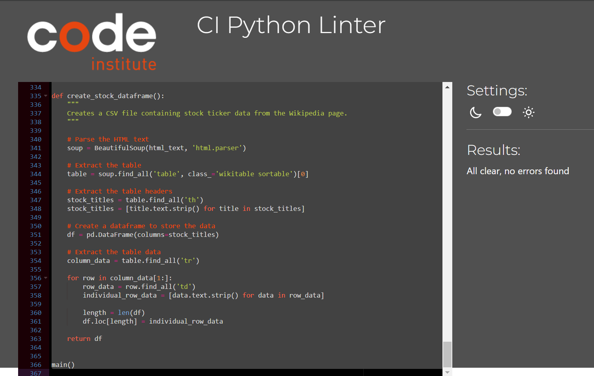

# Testing

## Validator Testing

- PEP8
  - No errors were returned from PEP8online.com

# Manual Testing

| Feature                        | Action                                      | Effect                                                                                      |
| ------------------------------ | ------------------------------------------- | ------------------------------------------------------------------------------------------- |
| Welcome Text                   | Start app                                   | Introduction text in typewriter                                                            |
| Username                       | Enter username                              | Saves username to Google Sheets                                                            |
| Stock Ticker Input             | Enter ticker or company                    | Checks if stock is found in the dataframe. If not found, requests new input. If found, informs the user and checks Google Sheet. If new, saves the symbol in Google Sheet. If not, informs the user. |
| User Menu                      | Enter ticker symbol / Select "back to menu" | Opens the user menu                                                                        |
| Show Latest Stock Data         | Enter "1"                                   | Informs the user that data is being retrieved. Shows the latest data (date, open price, highest price, close price, volume)                              |
| Show Daily Change              | Enter "2"                                   | Fetches stock data of 1 month and calculates daily changes                                  |
| Show 100 Day Average Price     | Enter "3"                                   | Fetches stock data of 1 year and gets 100 day moving average                               |
| Enter a New Stock Ticker Symbol | Enter "4"                                   | Runs a validation loop for a new ticker symbol. Opens the user menu                                                                        |
| Show Previous Searches         | Enter "5"                                   | Fetches Google Sheet user data. Checks for and displays previous searches                                                  |
| Quit                           | Enter "6" / Enter "2"                       | Quits the program                                                                         |
| Back to Menu                   | Enter "1"                                   | Opens the user menu                                                                       |

## User Stories

| User Story                                  | User Story Testing                                                                                          |
| ------------------------------------------- | ----------------------------------------------------------------------------------------------------------- |
| Enter and Save Username                     | The user is asked to enter a username, which is then stored in Google Sheets.                                |
| Enter Stock Ticker Symbol or Company Name    | The user is asked to enter an S&P 500 stock ticker symbol or a company name. The program then checks if the input is valid by searching for it in the dataframe. If not found, the user is informed and asked for new input. If found, the program checks if the ticker symbol is already stored in Google Sheets. If so, the user is informed. If not, it is stored, and the user is informed. |
| Get Latest Stock Data                       | The user can pick the option to get the latest stock data. The program then retrieves open, low, high, close price, and volume of the latest trading day. |
| Calculate Daily Change                      | The user can pick the option to show the daily change of the ticker symbol. The program retrieves the stock data of the last 30 days and calculates the daily changes. It then shows the dates, open and close prices, and daily changes. |
| Calculate 100 Day Moving Average            | The user can pick the option to show 100 day averages. The program retrieves one year's stock data, retrieves the 100 day moving averages, and then shows dates, close prices, and moving averages of the last 30 days. |
| See List of Previous Searches                | The user can pick the option to show previous searches. The program checks Google Sheets for username entries and displays stored ticker symbols. |
| Enter a New Stock Ticker Symbol              | The user can pick the option to enter a new S&P 500 stock ticker symbol or company name. When entering the data, the program again checks if the input is valid by searching for it in the dataframe. If not found, the user is informed and asked for new input. If found, the program checks if the ticker symbol is already stored in Google Sheets. If so, the user is informed. If not, it is stored, and the user is informed. |
| Go Back to User Menu                         | The user can pick the option to go back to the user menu. The user menu is displayed.                         |
| Quit the Program at Any Time                 | The user can pick the option to quit the program. The program is shut down.                                 |
